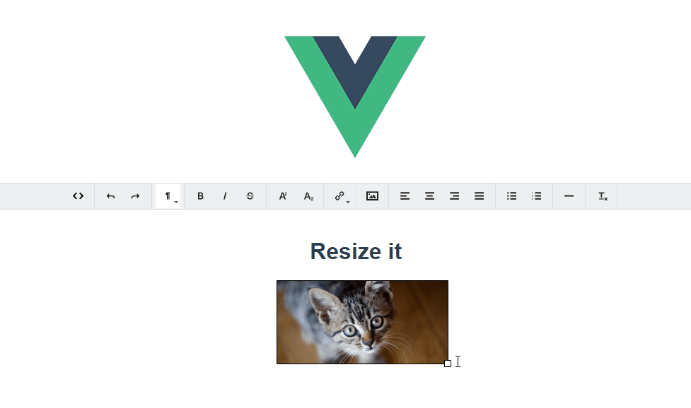

# vue-trumbowyg with Resizimg  plugin sample

[Vue-trumbowyg](https://github.com/ankurk91/vue-trumbowyg)

[Trumbowyg](https://alex-d.github.io/Trumbowyg/documentation/plugins/#plugin-resizimg)



## Project setup
```
yarn install
```

### Compiles and hot-reloads for development
```
yarn serve
```

### Compiles and minifies for production
```
yarn build
```

### Lints and fixes files
```
yarn lint
```

### Customize configuration
See [Configuration Reference](https://cli.vuejs.org/config/).
